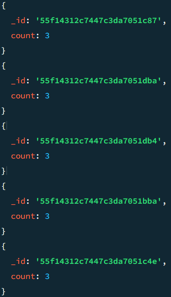
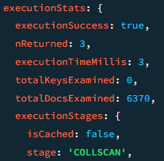
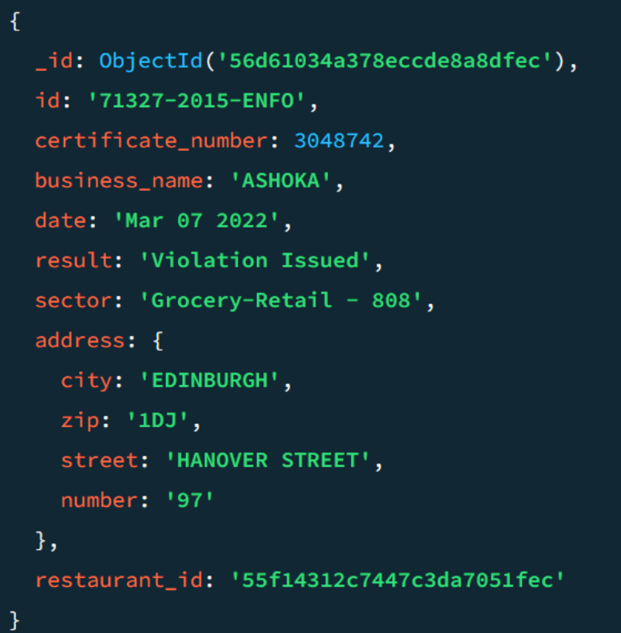
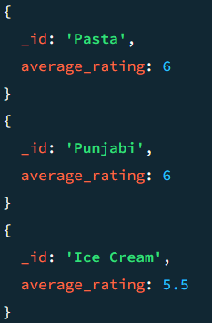
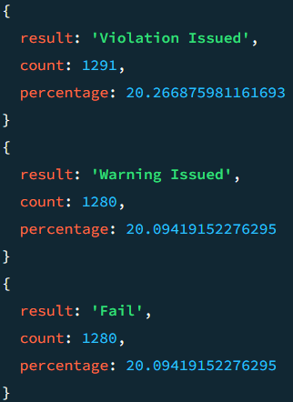
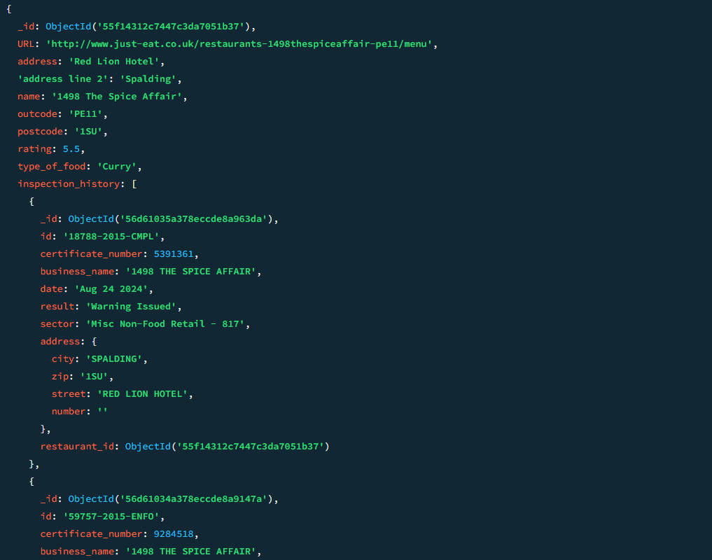

# Informe Práctica MongoDB

*Autores: Eloi Milego (1633753) y Raul Villar (1596830)*

## 1. Diseño del esquema de la base de datos

Para el diseño de nuestra base de datos primero hemos definido un caso de uso para determinar las consultas más frecuentes y por diseñar la base de datos para obtener el mejor rendimiento en base a dicho caso de uso.

Nuestro caso de uso planteado es el de utilizar la base de datos para realizar análisis de las inspecciones de restaurantes. De modo que se realizarán constantemente consultas sobre las inspecciones.

Algunas de estas consultas más comunes pueden ser:
- Filtrar inspeccions per resultat.
- Buscar inspeccions d’un restaurant concret.
- Buscar inspeccions d’una ciutat concreta.
- Buscar inspeccions amb una data específica.
- Obtenir les inspeccions amb violacions dins un rang de temps.


Una vez definido el caso de uso, hemos analizado las dos colecciones y hemos visto que una inspección está asociada a un restaurante, mientras que un restaurante puede tener varias inspecciones. Para determinar si la relación era one-to-few o one-to-many, hemos realizado algunas consultas.

La primera consulta ha sido para ver la media de inspecciones por restaurante.

```javascript
db.inspections.aggregate([
    {
      "$group": {
        "_id": "$restaurant_id",
        "count": { "$sum": 1 }
      }
    },
    {
      "$group": {
        "_id": null,
        "avg_inspections": { "$avg": "$count" }
      }
    }
  ])
```
El resultado obtenido en la consulta ha sido el siguiente:



Como podemos ver la media es de menos de 3 inspecciones  por restaurante lo que podria indicar un esquema one-to-few pero para asegurarlo vamos a mirar los restaurantes con más cantidad de inspecciones, por si en algun caso algun restaurante tuviera muchas.

Para ello hacemos una consulta que calcula la máxima cantidad de inspecciones que llega a tener un restaurante actualmente.

```javascript
db.inspections.aggregate([
  {
    "$group": {
      "_id": "$restaurant_id",
      "count": { "$sum": 1 }
    }
  },
  {
    "$sort": { "count": -1 }
  },
  {
    "$limit": 1
  }
])
```

El resultado obtenido es el siguiente:



Este resultado nos muestra que estamos de momento y mientras no crezca mucho el número de inspecciones ante un esquema one-to-few ya que un restaurante como máximo se relaciona con 3 inspecciones.

Una vez visto esto, hemos valorado la posibilidad de usar embeddings en lugar de referencias. Es decir, crear una nueva collection de restaurantes donde cada restaurante tenga un array de inspecciones con la información de cada inspección que se le ha realizado. Es una buena opción, teniendo en cuenta que cada restaurante por ahora tiene pocas inspecciones. Además usar embeddings podría ofrecer una accesibilidad más rápida y en una única consulta a las inspecciones de un restaurante concreto.

Sin embargo, hemos decidido quedarnos con el uso de referencias con el campo restaurant_id que refrencia el restaurante al que se le ha realizado una inspección concreta. El motivo de esta elección es que en un futuro puede ser que los restaurantes empiecen a recibir muchas más inspecciones (en principio se hacen inspecciones anuales) con lo que si usaramos embeddings el documento podría crecer mucho y tener peor rendimiento. Además si se quieren realizar consultas sobre las inspecciones de todos los restaurantes en caso de usar embeddings se debería acceder al documento entero lo cual es poco óptimo.

Para validar ambas colecciones se ha realizado un JSON Schema por cada colección. 
Para ver los json schema se pueden consultar las consultas 3 y 4 del fichero de consultas ([consultas.js](../scripts/consultas.js))

Para la coleccion de restaurantes el esquema asegura lo siguiente:
- _id (required) debe ser un ObjectId. Así evitamos que se generen ids que no sean un ObjectId y que todos los restaurantes tengan un id asociado.
- name (required) debe ser una cadena con al menos 1 carácter. Así evitamos que haya documentos de restaurantes sin nombre o con nombre vacío.
- address (required) debe ser una cadena con al menos 1 carácter. Así evitamos que haya documentos de restaurantes sin dirección o dirección vacía.
- outcode (required) Comprobamos que sea alfanumérico. Nos sirve para identificar geograficamente el restaurante.
- postcode (required) Igual que outcode. También comprobamos que sea alfanumérico.
- type_of_food (required) Hemos considerado ponerlo obligatorio ya que puede haber restaurantes con mucha variedad, pero ya que siempre hay alguna manera de describir el tipo de comida, lo hemos puesto obligatorio para poder utilizarlo como clave a la hora de hacer sharding. Aseguramos que el campo no esté vacío y tenga por lo menos un carácter.
- URL (opcional) debe ser una cadena que comience con http o https seguido de :// para evitar links fraudulentos. No es obligatorio ya que hay restaurantes sin web.

Para la coleccion de inspecciones (consulta 4) el esquema asegura lo siguiente:
- _id (required) debe ser un ObjectId. Es obligatorio para poder identificar cada inspección.
- id (required) debe ser una cadena. Es obligatorio ya que además de identificar como ObjectID cada inspección debe tener un id.
- certificate_number (required) debe ser un número entero positivo. Es obligatorio que la inspección esté certificada.
- business_name (required) debe ser una cadena con al menos 1 carácter. Es obligatorio indicar el nombre del restaurante.
- date (required) debe ser una cadena en el formato MMM DD YYYY (ej. Jan 15 2024). Requerimos este campo porque toda inspeccion tiene una fecha y indicamos este formato para poder consultar sobre las fechas de las inspecciones sin problemas.
- result (required) debe ser una cadena de texto. Toda inspección debe tener un resultado.
- address (required) es obligatorio ya que toda inspección se hace en algun sitio y debe ser un objeto que contenga:
  - city (required): una cadena con al menos 1 carácter obligatoria.
  - zip (required): una cadena con solo letras y números obligatoria.
  - street (opcional): una cadena opcional con al menos 1 carácter obligatorio, ya que en algunos casos (zonas rurales) se podría dar el caso de que la calle no tenga nombre.
  - number (opcional): una cadena opcional ya que no siempre una dirección tiene número.
- restaurant_id (required) debe ser un ObjectId que referencia a un restaurante. Obligatorio ya que es la referencia con la colección de restaurantes.


## 2. Implementación de consultas en MongoDB

- Buscar todos los restaurantes de un tipo de comida específico (ej. "Chinese").

Para buscar todos los restaurantes de un tipo de comida nos basaremos en el campo 'type_of_food' de la collection restaurants. Con un find de este campo es suficiente.

```javascript
var categoria = "Chinese"; // Define la comida deseada

db.restaurants.find({ 
  type_of_food: categoria 
});

```

Esta consulta la cual se basa en la variable 'categoria' para poder filtrar, devuelve una lista de todos los restaurantes con la comida deseada en este formato:


- Listar las inspecciones con violaciones, ordenadas por fecha.

Para listar las inspecciones con violaciones, filtraremos por resultado "Violation Issued"
Para poder ordenar por fecha, necesitamos pasar el string a un formato fecha que pueda ser ordenado cronologicamente, y despues ordenar con un .sort()

```javascript

db.inspections.aggregate([
  {
    $match: {
      result: "Violation Issued"
    }
  },
  {
    $addFields: {
      dateAsDate: {
        $dateFromString: {
          dateString: '$date',
          format: '%b %d %Y'
        }
      }
    }
  },
  {
    $sort: {
      dateAsDate: 1
    }
  },
  {
    $project: {
      dateAsDate: 0  
    }
  }
]);

```



- Encontrar restaurantes con una calificación superior a 4.

Para esta busqueda haremos un find filtrando el campo "rating" en que sea mayor a 4.

``` javascript

db.restaurants.find({
  "rating": { $gt: 4 }
});

```


### 3. Uso de agregaciones

En este apartado se realizan 3 consultas utilizando agregaciones de MongoDB.

CONSULTA X - Obtener el número de inspecciones por tipo de restaurante.

Para esta consulta se ha usado $match para excluir los restaurantes con valor en el campo rating de "Not rated yet".
Después hemos agrupado con $group con el tipo de comida (type_of_food) como _id y hemos calculado la media del rating para cada tipo.
Para calcular la media con $avg hemos convertido a double el campo rating que era un string.
Por último hemos ordenado por la media de puntuación de cada tipo de comida.

```javascript
db.restaurants.aggregate([
  {
    $match: {
      rating: { $ne: "Not yet rated" }  // Excluimos los que no tienen rating
    }
  },
  {
    $group: {
      _id: "$type_of_food",
      average_rating: { $avg: { $toDouble: "$rating" } }
    }
  },
  {
    $sort: { average_rating: -1 }
  }
])
```

Como resultado hemos obtenido el rating promedio de cada tipo de restaurante. En la imagen podemos ver los 3 con mayor media.



CONSULTA Y - Calcular el porcentaje de cada resultado de inspección.

En esta consulta hemos agrupado con $group para contar cuántas inspecciones hay por cada resultado (result).
Después, hemos vuelto a agrupar para calcular el total de inspecciones y almacenar los resultados en un array.
Con $unwind, descomponemos el array y calculamos el porcentaje de cada resultado con $divide para el tanto por 1 y multiplicando con $multiply para el porcentaje.
Por último, ordenamos por porcentaje en orden descendente.

```javascript
db.inspections.aggregate([
  //Agrupamos por resultado y contamos
  {
    $group: { 
      _id: "$result",
      count: { $sum: 1 } 
    }
  },
  //Calculamos el total y guardamos en un array los resultados del paso anterior
  {
    $group: {
      _id: null,
      results: { $push: { result: "$_id", count: "$count" } },
      total: { $sum: "$count" }
    }
  },
  // Descomponemos el array creado anteriormente
  { $unwind: "$results" },
  // Calculamos para cada array el porcentaje respecto el total
  {
    $project: {
      _id: 0,
      result: "$results.result",
      count: "$results.count",
      percentage: { 
        $multiply: [
          { $divide: ["$results.count", "$total"] },
          100 
        ] 
      }
    }
  },
  //Ordenamos por porcentaje
  { $sort: { percentage: -1 } }
]);
```

Como resultado hemos obtenido la cantidad de inspecciones para cada resultado posible y su porcentaje. Hemos podido ver que los porcentajes son muy iguales, con lo que los resultados se reparten bastante.
En la imagen podemos ver los 3 resultados más comunes, aunque todos lo son ya que está muy igualado.



CONSULTA Z - Unir restaurantes con sus inspecciones usando $lookup.

En esta consulta hemos utilizado $lookup para unir los restaurantes con la colección de inspecciones.
La unión se hace entre el campo _id de la colección restaurants y el campo restaurant_id de inspections.
El resultado se almacena en un nuevo campo llamado inspection_history, que contiene un array con las inspecciones de cada restaurante.

```javascript
db.restaurants.aggregate([
  {
    $lookup: {
      from: "inspections",
      let: { restaurant_id: "$_id" },
      pipeline: [
        {
          $addFields: {
            restaurant_id: { $toObjectId: "$restaurant_id" }
          }
        },
        {
          $match: {
            $expr: { $eq: ["$restaurant_id", "$$restaurant_id"] }
          }
        }
      ],
      as: "inspection_history"
    }
  }
]);
```

En la siguiente imagen podemos ver como para el restaurante 1498 The Spice Affair se le ha unido un array con sus inspecciones a través de $lookup.



## 4. Optimización del rendimiento

Para la optimización del rendimiento lo primero que se ha hecho ha sido identificar para nuestro caso de uso "Analisis de tendencias en inspecciones del sector de la restauración" las consultas más comunes y se han implementado índices adecuados es base a ellos.

### CONSULTA 1 - Agrupar inspecciones por resultado

Consideramos que agrupar las consultas según su resultado es algo que puede ser bastante común a la hora de querer realizar estadísticas y analizar las inspecciones de un grupo de restaurantes, de un restaurante concreto o de todos los restaurantes.

```javascript
//Consulta común (con explain) - Encontrar todas las inspecciones con un resultado específico
db.inspections.find({ result: "Fail" }).explain("executionStats");
//Índice creado
db.inspections.createIndex({ result: 1 });
```

Rendimiento antes de crear el índice:
  - stage: COLLSCAN 
  - nReturned: 1280
  - totalKeysExamined: 0,
  - totalDocsExamined: 6370,


Rendimiento después de crear el índice:
  - stage: IXSCAN
  - nReturned: 1280
  - totalKeysExamined: 1280,
  - totalDocsExamined: 1280,
  - keyPattern: {
      result: 1
    },

### CONSULTA 2 - Encontrar inspecciones de un restaurante en concreto

Será una consulta muy común querer encontrar todas las inspecciones de un restaurante específico.

```javascript
//Consulta común (con explain) - Encontrar todas las inspecciones de un restaurante específico
db.inspections.find({ restaurant_id: ObjectId('55f14312c7447c3da7051b30') }).explain("executionStats");
//Índice creado
db.inspections.createIndex({ restaurant_id: 1 });
```

Rendimiento antes de crear el índice:
  - stage: COLLSCAN 
  - nReturned: 3
  - totalKeysExamined: 0,
  - totalDocsExamined: 6370,

Rendimiento después de crear el índice:
  - stage: IXSCAN
  - nReturned: 3
  - totalKeysExamined: 3,
  - totalDocsExamined: 3,
  - keyPattern: {
      restaurant_id: 1
    },

### CONSULTA 3 - Encontrar todas las inspecciones de una ciudad específica

Será una consulta muy común querer encontrar todas las inspecciones por ciudad ya que permitirá estudiar la diferencia entre zonas geográficas.

```javascript
//Consulta común (con explain) - Encontrar todas las inspecciones de una ciudad específica
db.inspections.find({ "address.city": "CARDIFF" }).explain("executionStats");
//Índice creado
db.inspections.createIndex({ "address.city": 1 });
```

Rendimiento antes de crear el índice:
  - stage: COLLSCAN 
  - nReturned: 37,
  - totalKeysExamined: 0,
  - totalDocsExamined: 6370,

Rendimiento después de crear el índice:
  - stage: IXSCAN
  - nReturned: 37
  - totalKeysExamined: 37,
  - totalDocsExamined: 37,
  - keyPattern: {
      'address.city': 1
    },

### CONSULTA 4 - Encontrar todas las inspecciones con una fecha específica

Puede ser muy común querer filtrar por la fecha de inspección para analizar las inspecciones en el tiempo.

```javascript
    //Consulta común (con explain) - Encontrar todas las inspecciones con una fecha específica
    db.inspections.find({ date: "Apr 07 2022" }).explain("executionStats");
    //Índice creado
    db.inspections.createIndex({ date: 1 });
```
Rendimiento antes de crear el índice:
  - stage: COLLSCAN 
  - nReturned: 5,
  - totalKeysExamined: 0,
  - totalDocsExamined: 6370,

Rendimiento después de crear el índice:
  - stage: IXSCAN
  - nReturned: 5
  - totalKeysExamined: 5,
  - totalDocsExamined: 5,
  - keyPattern: {
      date: 1
    },

Como hemos podido ver en estas 4 consultas comunes para nuestro caso de uso de analisis de las inspecciones, el uso de índices para ciertos campos usados frecuentemente ofrecen una gran optimización en muchas consultas reduciendo así el número de documentos escaneados y el tiempo de la consulta y ofreciendo un mejor rendimiento global.

## 5. Estrategias de escalabilidad

La primera estrategia para mejorar la escalabilidad de nuestra base de datos es aplicar sharding.

Para aplicar sharding en nuestro dataset, puesto a que usamos las collections originales, necesitamos un campo para cada colección.
Para nuestro objetivo de la base de datos, será util buscar por rangos los restaurantes, un sharding por rangos se puede ajustar más a nuestro caso de uso, y no depender de usar todos los shards a la hora de hacer consultas. Mientras para inspecciones, es mas prioritario distribuir equitativamente, que las propias busquedas por rangos, de manera que un hash se adapta mejor a nuestra situación.

Los campos más utilizados para hacer consultas son:
Para la collection restaurants:
  
  &nbsp;&nbsp; -rating
  
  &nbsp;&nbsp; -type_of_food

Para la collection inspections:
  
  &nbsp;&nbsp; -result
  
  &nbsp;&nbsp; -restaurant_id
  
  &nbsp;&nbsp; -address.city
  
  &nbsp;&nbsp; -date

 De estos campos debemos elegir un campo con un rango definido, y que pueda separar los valores en una gran cantidad de shards.
 Para la collection restaurants usaremos los campos 'rating' y 'type_of_food' para hacer un sharding combinado por rangos con clave doble para aumentar la cantidad de shards posibles y basado en las consultas mas comunes que haremos.
 Para la collection inspections usaremos 'result' y 'restaurant_id' en un sharding combinado, ya que nuestro objetivo principal es poder distribuirlos bien en muchos shards.

Una vez tenemos el sharding, podemos diseñar un esquema con replicación para aumentar la disponibilidad:


Nuestras decisiones se han basado de acuerdo a nuestro caso de uso, pero este puede variar con el tiempo y acarrear problemas a la larga que habría que solucionar. A continuación presentamos los cuellos de botella mas posibles en un caso futuro de nuestro caso de uso.

Cuellos de botella debidos a sharding:

Aunque tenemos la collection inspections por 'result' y 'restaurant_id', si un restaurante tiene muchísimas inspecciones puede generar un cuello de botella muy grande debido a que se almacenaria todo en el mismo shard.

Para la collection restaurants, si se genera una gran cantidad de restaurantes con un 'rating' y 'type_of_food' iguales, generará un gran cuello de botella debido a que se almacenarán en el mismo shard.

La solución para estos cuellos de botella es en caso de alguno de estos casos de gran creación de entradas con mismo restaurante o tipo de comida y rating, estudiar si es mejor un sharding por hash.

Cuellos de botella debidos a disponibilidad:

Si una de las replicas falla se quedarán dos replicas disponibles, lo que puede producir empates en las votaciones y retrasar el reemplazo. Para solucionarlo añadiremos una replica arbitro, la cual solo pueda votar.

Cuellos de botella debido a las colecciones:

Tenemos las dos colecciones separadas, sin ninguna colección que las combine, esto puede generar un gran cuello de botella si hay muchas consultas que necesiten datos de ambas colecciones. La solución es hacer un caso de estudio para analizar cuanto de común son estas consultas y si se ganaría una mejora de rendimiento entre el coste que tiene crear y mantener una tercera collection, y la mejora de cuello de botella.