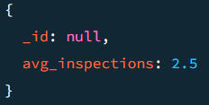
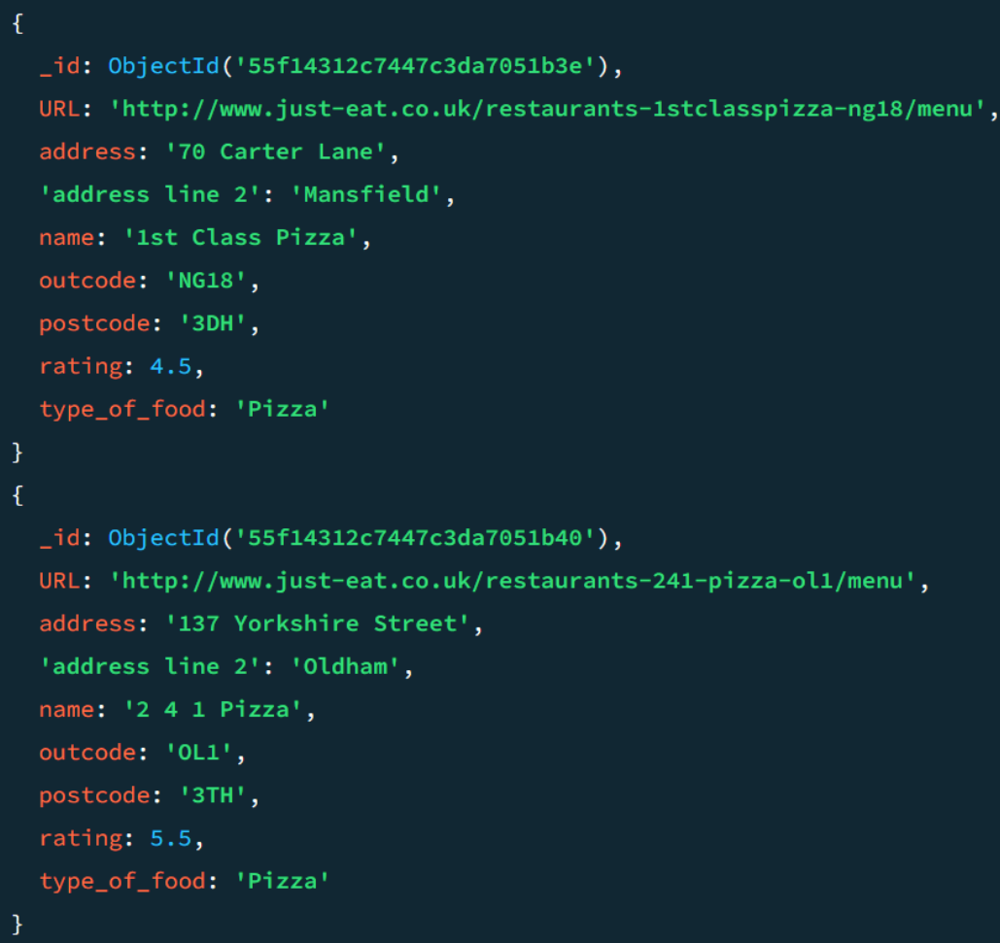
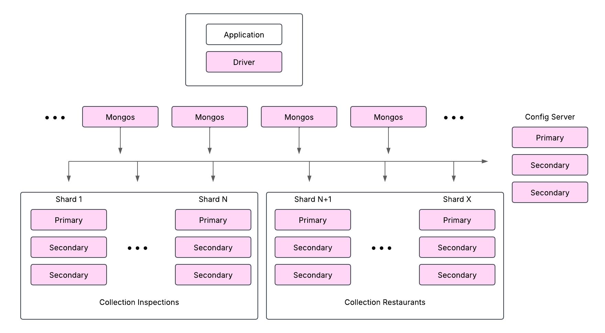

# Informe Práctica MongoDB

*Autores: Eloi Milego (1633753) y Raul Villar (1596830)*

## Tareas Obligatorias (Hasta 4 puntos)

Estas tareas deben realizarse obligatoriamente para aprobar la práctica:

### 1. Diseño del esquema de la base de datos

- Analizar la estructura de los datos y determinar el tipo de relación entre restaurantes e inspecciones (One-to-Few, One-to-Many, One-to-Millions).

Primero de todo, hemos analizado las dos colecciones y hemos visto que una inspección está asociada a un restaurante, mientras que un restaurante puede tener varias inspecciones. Para determinar si la relación era one-to-few o one-to-many, hemos realizado algunas consultas.

La primera consulta ha sido para ver la media de inspecciones por restaurante. Se trata de la consulta 1 que se encuentra en el archivo de consultas ([consultas.js](../scripts/consultas.js))


```javascript
db.inspections.aggregate([
    {
      "$group": {
        "_id": "$restaurant_id",
        "count": { "$sum": 1 }
      }
    },
    {
      "$group": {
        "_id": null,
        "avg_inspections": { "$avg": "$count" }
      }
    }
  ])
```
El resultado obtenido en la consulta ha sido el siguiente:



Como podemos ver la media es de menos de 3 inspecciones  por restaurante lo que podria indicar un esquema one-to-few pero para asegurarlo vamos a mirar los restaurantes con más cantidad de inspecciones, por si en algun caso algun restaurante tuviera muchas.

Para ello hacemos una consulta que calcula la máxima cantidad de inspecciones que llega a tener un restaurante actualmente. Se trata de la consulta 2 que se encuentra en el archivo de consultas ([consultas.js](../scripts/consultas.js))

El resultado obtenido es el siguiente:



- Justificar la elección de referencias (`restaurant_id`) en lugar de documentos embebidos.
También puedes decidir crear una nueva collection que no utilice las referencias e incorpore los documentos embebidos.

Hemos valorado la posibilidad de usar embeddings en lugar de referencias. Es decir, crear una nueva collection de restaurantes donde cada restaurante tenga un array de inspecciones con la información de cada inspección que se le ha realizado. Es una buena opción, teniendo en cuenta que cada restaurante por ahora tiene pocas inspecciones. Además usar embeddings podría ofrecer una accesibilidad más rápida y en una única consulta a las inspecciones de un restaurante concreto.

Sin embargo, hemos decidido quedarnos con el uso de referencias con el campo restaurant_id que refrencia el restaurante al que se le ha realizado una inspección concreta. El motivo de esta elección es que en un futuro puede ser que los restaurantes empiecen a recibir muchas más inspecciones (en principio se hacen inspecciones anuales) con lo que si usaramos embeddings el documento podría crecer mucho y tener peor rendimiento. Además si se quieren realizar consultas sobre las inspecciones de todos los restaurantes en caso de usar embeddings se debería acceder al documento entero lo cual es poco óptimo.

- Definir un esquema de validación para ambas colecciones.

Para validar ambas colecciones se ha realizado un JSON Schema por cada colección. 
Los json schema son las consultas 3 y 4 del fichero de consultas ([consultas.js](../scripts/consultas.js))

Para la coleccion de restaurantes (consulta 3) el esquema asegura lo siguiente:
- _id debe ser un ObjectId válido.
- id debe ser una cadena con el formato NNN-NNNN-AAA (ej. 123-2023-ENF).
- certificate_number debe ser un número entero positivo.
- business_name debe ser una cadena con al menos 1 carácter.
- date debe ser una cadena en el formato MMM DD YYYY (ej. Jan 15 2024).
- result debe ser una cadena de texto.
- address debe ser un objeto que contiene:
  - city: una cadena con al menos 1 carácter.
  - zip: una cadena con solo letras y números.
  - street: una cadena con al menos 1 carácter.
  - number: una cadena opcional.
- restaurant_id debe ser un ObjectId válido que referencia a un restaurante.
- todos los campos son requeridos

Para la coleccion de inspecciones (consulta 4) el esquema asegura lo siguiente:
- _id debe ser un ObjectId válido.
- name debe ser una cadena con al menos 1 carácter.
- address debe ser una cadena con al menos 1 carácter.
- outcode (opcional) debe ser una cadena que contenga solo letras y números.
- postcode (opcional) debe ser una cadena que contenga solo letras y números.
- type_of_food (opcional) debe ser una cadena con al menos 1 carácter.
- URL (opcional) debe ser una cadena que comience con http o https seguido de :// 

### 2. Implementación de consultas en MongoDB

- Buscar todos los restaurantes de un tipo de comida específico (ej. "Chinese").

Para buscar todos los restaurantes de un tipo de comida nos basaremos en el campo 'type_of_food' de la collection restaurants. Con un find de este campo es suficiente.

```javascript
var categoria = "Chinese"; // Define la comida deseada

db.restaurants.find({ 
  type_of_food: categoria 
});

```

Esta consulta la cual se basa en la variable 'categoria' para poder filtrar, devuelve una lista de todos los restaurantes con la comida deseada en este formato:


- Listar las inspecciones con violaciones, ordenadas por fecha.

Para listar las inspecciones con violaciones, filtraremos por resultado "Violation Issued"
Para poder ordenar por fecha, necesitamos pasar el string a un formato fecha que pueda ser ordenado cronologicamente, y despues ordenar con un .sort()

```javascript

db.inspections.aggregate([
  {
    $match: {
      result: "Violation Issued"
    }
  },
  {
    $addFields: {
      dateAsDate: {
        $dateFromString: {
          dateString: '$date',
          format: '%b %d %Y'
        }
      }
    }
  },
  {
    $sort: {
      dateAsDate: 1
    }
  },
  {
    $project: {
      dateAsDate: 0  
    }
  }
]);

```

- Encontrar restaurantes con una calificación superior a 4.

Para esta busqueda haremos un find filtrando el campo "rating" en que sea mayor a 4.

``` javascript

db.restaurants.find({
  "rating": { $gt: 4 }
});

```

### 3. Uso de agregaciones

- Agrupar restaurantes por tipo de comida y calcular la calificación promedio.
- Contar el número de inspecciones por resultado y mostrar los porcentajes.
- Unir restaurantes con sus inspecciones utilizando `$lookup`.

Ejemplo de `$lookup`:

```javascript
db.restaurants.aggregate([
    {
        "$lookup": {
            "from": "inspections",
            "localField": "_id",
            "foreignField": "restaurant_id",
            "as": "inspection_history"
        }
    }
]);
```

## Tareas Avanzadas (Hasta 6 puntos)

Estas tareas son más complejas y exploratorias y por lo tanto más abiertas:

### 1. Optimización del rendimiento

- Identificar las posibles consultas más frecuentes.
- Implementar índices adecuados para esas consultas.
- Comparar el rendimiento antes y después de crear los índices utilizando `explain()`.

### 2. Estrategias de escalabilidad

- Proponer una estrategia de sharding adecuada para este dataset.

Para aplicar sharding en nuestro dataset, puesto a que usamos las collections originales, necesitamos un campo para cada colección.
Para nuestro objetivo de la base de datos, será util buscar por rangos los restaurantes, un sharding por rangos se puede ajustar más a nuestro caso de uso, y no depender de usar todos los shards a la hora de hacer consultas. Mientras para inspecciones, es mas prioritario distribuir equitativamente, que las propias busquedas por rangos, de manera que un hash se adapta mejor a nuestra situación.

Los campos más utilizados para hacer consultas son:
Para la collection restaurants:
  
  &nbsp;&nbsp; -rating
  
  &nbsp;&nbsp; -type_of_food

Para la collection inspections:
  
  &nbsp;&nbsp; -result
  
  &nbsp;&nbsp; -restaurant_id
  
  &nbsp;&nbsp; -address.city
  
  &nbsp;&nbsp; -date

 De estos campos debemos elegir un campo con un rango definido, y que pueda separar los valores en una gran cantidad de shards.
 Para la collection restaurants usaremos los campos 'rating' y 'type_of_food' para hacer un sharding combinado por rangos con clave doble para aumentar la cantidad de shards posibles y basado en las consultas mas comunes que haremos.
 Para la collection inspections usaremos 'result' y 'restaurant_id' en un sharding combinado, ya que nuestro objetivo principal es poder distribuirlos bien en muchos shards.

- Diseñar un esquema de replicación para alta disponibilidad.



- Analizar posibles cuellos de botella y soluciones.

Cuellos de botella debidos a sharding:

Aunque tenemos la collection inspections por 'result' y 'restaurant_id', si un restaurante tiene muchísimas inspecciones puede generar un cuello de botella muy grande debido a que se almacenaria todo en el mismo shard.

Para la collection restaurants, si se genera una gran cantidad de restaurantes con un 'rating' y 'type_of_food' iguales, generará un gran cuello de botella debido a que se almacenarán en el mismo shard.

La solución para estos cuellos de botella es en caso de alguno de estos casos de gran creación de entradas con mismo restaurante o tipo de comida y rating, estudiar si es mejor un sharding por hash.

Cuellos de botella debidos a disponibilidad:

Si una de las replicas falla se quedarán dos replicas disponibles, lo que puede producir empates en las votaciones y retrasar el reemplazo. Para solucionarlo añadiremos una replica arbitro, la cual solo pueda votar.

Cuellos de botella debido a las colecciones:

Tenemos las dos colecciones separadas, sin ninguna colección que las combine, esto puede generar un gran cuello de botella si hay muchas consultas que necesiten datos de ambas colecciones. La solución es hacer un caso de estudio para analizar cuanto de común son estas consultas y si se ganaría una mejora de rendimiento entre el coste que tiene crear y mantener una tercera collection, y la mejora de cuello de botella.